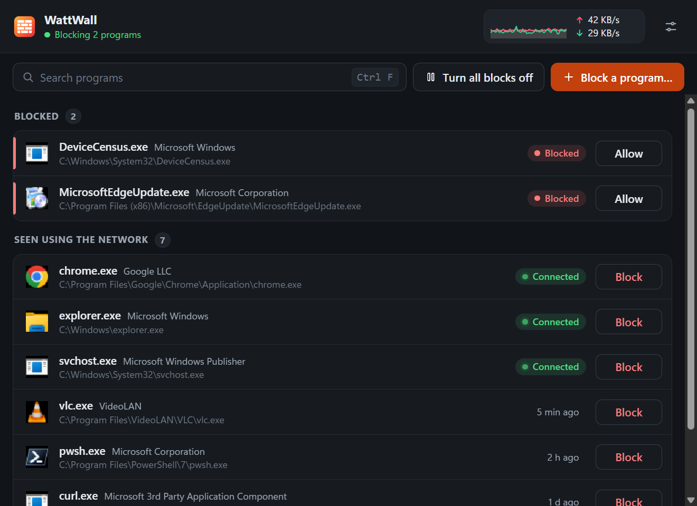

# WattWall

WattWall blocks the programs you choose, using the Windows Firewall that is already on your PC. Pick a program, press Block, and it can no longer reach the network in either direction. Every other program carries on as before, and Windows still blocks unsolicited inbound traffic as it always has.



## What it does

- **Shows who is on the network.** Every program with a connection or an open port appears with its icon, verified publisher and when it was last seen. Programs you have blocked are listed at the top.
- **Blocks in one click.** Block adds two firewall rules for that program's file, outbound and inbound, and closes the connections it already has. Allow removes them. Block a program lets you pick any `.exe`.
- **Turn all blocks off, and on again.** Handy for checking whether a block is what stopped something working. The rules are switched off, not deleted.
- **Live tray and taskbar icon.** A small brick wall with a red bar for data sent and a green bar for data received, redrawn every second, like ZoneAlarm's tray meter. The wall turns grey while blocks are off. The taskbar button shows the same icon while the window is open, and the window header shows the last minute as a graph.
- **Starts with Windows, hidden in the tray.** The installed copy starts at sign-in without opening its window and without a UAC prompt. Turn it off in Settings.
- **Updates itself** from this repository's releases: download, install and restart, with only a banner.
- **Asks first** before blocking programs Windows or your VPN need (`svchost.exe`, `lsass.exe`, `tailscaled.exe`, `tailscale-ipn.exe`) or WattWall itself. `System` has no program file, so it cannot be blocked.

## Where the rules live

Each block is two rules in Windows Defender Firewall, in a group named WattWall. You can see them in `wf.msc`. WattWall only ever changes rules it created, and those rules are the record of what is blocked: the app itself keeps only the list of programs it has seen and the start-with-Windows choice, in `%LOCALAPPDATA%\WattWall\settings.json`.

## Install

Download from [Releases](https://github.com/Swatto86/WattWall/releases):

- `WattWall_<version>_x64-setup.exe` installs for all users into `C:\Program Files\WattWall`, starts with Windows and updates itself.
- `WattWall_<version>_x64-portable.exe` runs on its own. It asks for administrator each time it opens and cannot start with Windows.
- `SHA256SUMS.txt` has a checksum for every file.

Requirements: Windows 10 or 11, 64-bit, and the [Microsoft Edge WebView2 Runtime](https://developer.microsoft.com/microsoft-edge/webview2/) (part of Windows 11; the installer fetches it if it is missing). Changing firewall rules needs administrator, so WattWall asks for it when it opens. The logon start is already elevated, so it does not ask.

## Remove everything

`WattWall.exe --cleanup` removes WattWall's firewall rules, the logon task and WattWall's saved list. Running it again does nothing and is not an error. Uninstalling asks whether to remove the rules and always removes the logon task.

## Build from source

Needs Rust (the version in `rust-toolchain.toml`, MSVC), Node 22 or later and the [Tauri prerequisites for Windows](https://v2.tauri.app/start/prerequisites/).

```powershell
npm ci
npm run tauri dev
pwsh scripts/verify.ps1
```

`tauri dev` runs a debug build, which does not elevate itself: it lists programs, but changing a real block needs an administrator terminal. `scripts/verify.ps1` is the full gate: formatting, clippy, Rust and frontend tests, a debug build and a WebDriver journey that drives the real app against a file-backed stand-in for the firewall. The app icons are drawn from `src-tauri/icons/source` by `node scripts/icons.mjs`; the tray icon is drawn at run time.

`ARCHITECTURE.md` maps the code and `CONTEXT.md` records the decisions behind it.

## Licence

[MIT](LICENSE)
